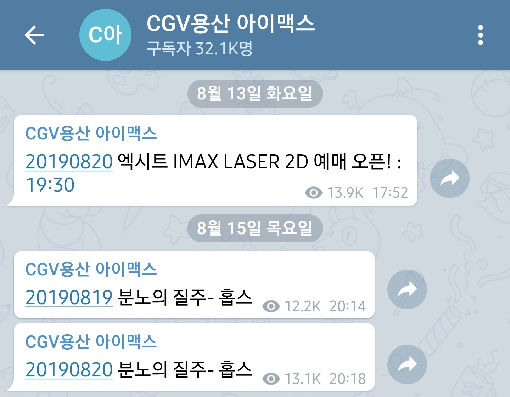
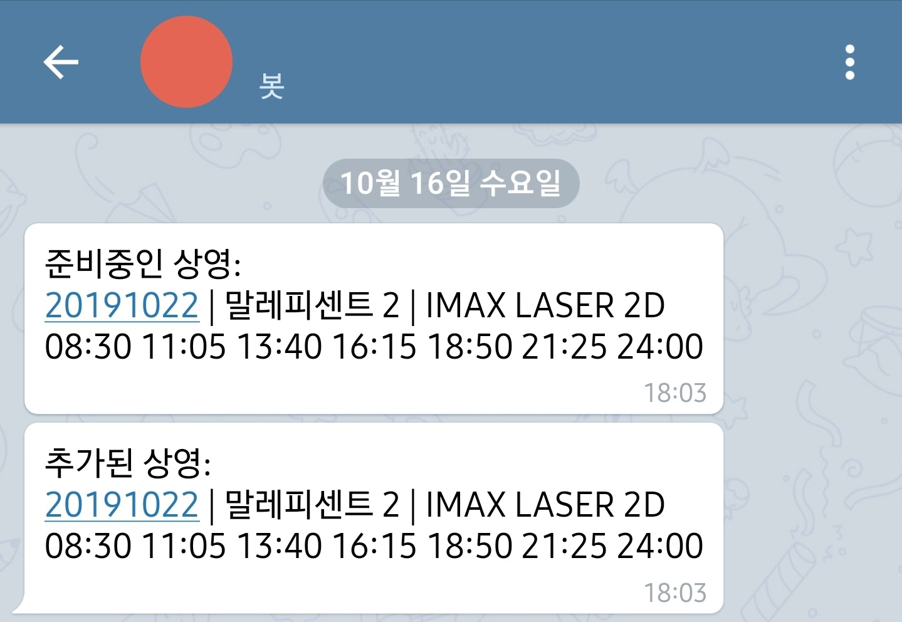

# CGV 예매 알리미

> - 소스코드는 어뷰징의 가능성이 있어 공개하지 않습니다. 이 점 양해 바랍니다.
> - 실제 소스코드는 120줄 정도로 간단한 Python 코드 입니다.
> - 제가 만든 알리미도 공개가 어렵습니다. 저에게만 메시지를 보내도록 설계되어 있기도 하고
  제가 보고싶은 영화가 있을때만 사용하는 지라 스크립트를 24시간 돌리고 있지도 않기 때문입니다.

## 왜 이런게 필요한가요?
결론부터 말하자면 영화 예매시 더 좋은 자리를 차지하기 위함입니다.

최근 많은 영화들이 IMAX 포맷으로 개봉하고 있습니다.  
특히 헐리우드 영화는 거의 대부분 IMAX 포맷으로 개봉한다고 해도 과언이 아닙니다.  

IMAX 포맷은 기존의 포맷과 다르게 더 큰 화면, 더 나은 화질과 사운드를 제공함으로써 관객들에게 더 몰입감 있는 영화 경험을 제공하는 포맷입니다.  
그렇다 보니 많은 영화 매니아들이 이 포맷으로 영화를 보고싶어 하며 유명 헐리우드 영화의 경우 암표까지 등장할 정도입니다.  

CGV는 이러한 IMAX 포맷을 국내에서 독점적으로 공급하고 있으며 또한 멀티플렉스 영화관 중에서는 세계 최대 스크린의 IMAX관을 용산점에 보유하고 있습니다.  
게다가 IMAX 스크린의 거대한 크기 때문에 앞자리는 많은 사람들이 기피하다보니 흔히 말하는 '명당' 자리인 정 가운데에서 영화를 보기 위해 많은 사람들이 경쟁하고 있습니다.  

하지만 영화 예매는 공연 예매 처럼 예매 오픈 시각이 정해져 있지 않기 때문에 수시로 예매창을 봐야한다는 불편함이 있습니다.  
그래서 이를 해결하기 위해 컴퓨터에게 대신 예매창을 감시하도록 시키는 예매 알리미를 만들게 되었습니다.

## 이런거 이미 있지 않나요?
네. 이미 있습니다.

## 그런데 왜 만들었나요?
다른분들이 만든게 몇가지 문제가 있었기 때문입니다.

### 1. 제가 원할때 서비스를 제공받지 못할 수 있습니다.
<https://twitter.com/imaxnotify_ys>  
이 트위터 계정은 후에 나온 텔레그램 채널을 알기 전까지 주로 사용했던 예매 알리미 입니다.  
그런데 2019년 이후로 무슨 이유인지 업데이트가 이루어지지 않고 있습니다.  
이렇듯 개발자가 지원을 중단해버리면 더이상 사용할 수 없는 문제가 있습니다.

### 2. 이미 존재하는 서비스에 오류가 있습니다.
<https://t.me/cgvyongsan>  
  
위 링크는 CGV 용산 IMAX 예매를 알려주는 텔레그램 공개 채널이며 그 아래 사진은 알림에 오류가 발생한 모습입니다.  
위와같이 영화 엑시트 알림은 정상적으로 왔지만 분노의 질주 알림은 뒷부분이 잘렸습니다.  
더욱 심각한 문제는 이렇게 오류가 발생했음에도 개발자가 오류를 전혀 고치지 않고 있습니다.

> 이에 대한 원인을 분석해보자면 다음과 같습니다.
> 
> 우선 텔레그램에는 여러 사용자가 들어올 수 있는 '채널'이 있고, 텔레그램 유저와 유사지만 사람은 아닌 '봇'이 존재합니다.  
> 텔레그램에서 채널에 메시지를 보내려면 특정 텔레그램 봇을 채널 관리자로 지정한 뒤, 해당 봇의 토큰을 이용하여 sendMessage 메소드를 호출해야 합니다.  
> sendMessage API 문서: <https://core.telegram.org/bots/api#sendmessage>  
> 따라서 다음과 같은 URL을 호출하면 채널에 메시지를 보낼 수 있습니다.  
> `https://api.telegram.org/bot[BOT_TOKEN]/sendMessage?chat_id=[CHANNEL_NAME]&text=[MESSAGE]`  
> 위와같이 메시지는 GET 요청의 `text` 파라미터로 들어갑니다.  
> 그런데 오류가 난 메시지를 보면 **<u>분노의 질주- 홉스</u>** 까지만 나와있습니다.  
> 이 부분에는 영화 제목이 나와야 하는데 영화의 제목은 **<u>분노의 질주- 홉스&쇼</u>** 입니다.  
> 따라서 이로 미루어볼 때 메시지에서 URL에 들어가는 특수문자를 제대로 처리하지 않은 채 GET의 파라미터로 넘긴게 메시지가 잘린 원인이라고 추측할 수 있습니다.  
> 따라서 이 문제를 해결하기 위해서는 `text` 파라미터에 들어가는 메시지를 [URL Encoding](https://ko.wikipedia.org/wiki/%ED%8D%BC%EC%84%BC%ED%8A%B8_%EC%9D%B8%EC%BD%94%EB%94%A9) 한 뒤 넣어준다면 해결될 것입니다.

> 추가로 텔레그램의 메소드를 호출하는 방법은 GET 방식 말고도 POST 방식도 지원하고 있습니다.
>> <https://core.telegram.org/bots/api#making-requests>  
>> We support GET and POST HTTP methods. We support four ways of passing parameters in Bot API requests:
>> - URL query string
>> - application/x-www-form-urlencoded
>> - application/json (except for uploading files)
>> - multipart/form-data (use to upload files)  
> 
> 위의 분석에서는 `URL query string`을 사용했다고 가정했지만 다음과 같은 경우도 생각해볼 수 있습니다.
> - `application/x-www-form-urlencoded`을 사용했다면 `URL query string`과 마찬가지로 `key1=value1&key2=value2&...`와 같은 포맷으로 파라미터를 전송하므로 똑같이 URL Encoding을 해야 합니다. 개발자 분께서 GET 방식을 사용하지 않았다면 이 방식으로 파라미터를 넘겼을 것이라고 추측할 수 있습니다.
> - `application/json`에서는 `&`를 특수문자로 사용하지 않으므로 이를 사용했다면 위와 같은 오류가 발생했을 가능성은 없습니다. 다만 이를 사용하려면 영화 제목에 JSON에 들어가는 특수문자가 들어가지 않는다는 보장이 없으므로 이를 적절히 처리하는 코드를 짜거나 Python이라면 내장 라이브러리인 `json` 라이브러리를 사용하는것이 좋습니다.
> - `multipart/form-data`는 주로 파일을 업로드 하는데 사용되므로 단순히 메시지를 전송하는데 이와 같은 방식을 사용할 이유가 없습니다.

### 3. 다른 영화관은 확인할 수가 없습니다.
이러한 알림은 주로 CGV 주요 지점의 IMAX나 4DX같은 인기 포맷의 예매정보만 제공합니다. 그렇다 보니 그 외의 예매정보는 얻을 수 없다는 문제가 있습니다.  
만약 CGV에서 더 좋은 상영관이라도 만든다면 알리미를 개발하신 분이 새로운 알리미를 만들지 않는 한 해당 관의 예매 정보는 받아올 수가 없습니다.

## 그래서 어떻게 개발했나요?
- 우선 개발 언어로는 Python을 선택했습니다.
  - Python을 고른 이유는 웹 크롤링에 필요한 다양한 라이브러리가 존재하기 때문에 선택하게 되었습니다.
    - HTML 문서 다운로드와 텔레그램 API를 이용하기 위해 requests 모듈을 사용하였습니다.  
    - HTML 파싱을 위해 BeautifulSoup 라이브러리와 urlib 패키지 내 parse 모듈을 사용하였습니다.  
    - 텔레그램 메시지 전송에는 [python-telegram-bot](https://github.com/python-telegram-bot/python-telegram-bot) 이라는 라이브러리도 존재하지만 저는 메시지 전송 한가지의 기능만 사용할 것이므로 굳이 이를 이용하기 보다는 requests를 사용하여 직접 구현하였습니다.
- 또한 알림은 텔레그램 봇을 이용하기로 했습니다.
  - 텔레그램은 API가 공개되어 있으며 이를 이용해 상대방에게 메시지를 보내는 과정도 매우 간단합니다.
  - 또한 텔레그램 봇을 이용하면 복잡한 푸시 서버를 이용하지 않고도 간단하게 저에게 알림을 보낼 수 있습니다.
  - 무엇보다도 이 모든게 무료이기 때문에 텔레그램 봇을 선택했습니다.
- 또한 CGV 예매창의 구조를 알아야 하기 때문에 크롬 브라우저의 개발자 도구를 이용하여 HTML을 로딩하는 과정과 해당 HTML의 구조를 파악했습니다.

## 결과를 보여줄 수 있나요?
  
좀전에 소개한 텔레그램 채널과는 달리 예매 정보를 정확하게 가져오고 있습니다.  
또한 HTML 다운로드시 파라미터만 수정한다면 얼마든지 다른 지점의 예매정보를 가져올 수 있습니다.

## 결과물에 아쉬운 부분이 있다면?
* 이 코드를 실행할 디바이스가 있어야 합니다. 그리고 그 디바이스는 결코 공짜가 아닙니다.  
* 다른 지점의 예매 정보를 보려면 코드에 하드코딩 되어있는 파라미터를 수정해야 합니다.
* 그 파라미터를 알아내려면 또 다시 CGV 홈페이지를 분석해야 합니다.

## 프로젝트를 진행하고 느낀점이 있나요?
- Python을 배운 뒤로 처음 작성해본 스크립트였는데 왜 다들 Python을 선호하는지 알 수 있을 정도로 코드를 쉽게 작성할 수 있다는 것을 알게 되었습니다.  
- 예매창을 파싱하면서 생각보다 다양한 예매 상태가 있었고, 이를 모두 예외처리하는데 대부분의 시간을 쏟았습니다. 이로 인해 그동안 과제를 하면서 느꼈던 예외처리의 중요성을 다시한번 느끼게 되었습니다.  
- 이 스크립트를 만들면서 텔레그램 메시지 전송을 위해 API 문서를 찾아보았는데 굉장히 체계적이고 구체적으로 짜여있다는 느낌을 받았습니다. 저도 작은 프로젝트에서 API 규격을 만들어 본적은 있지만 이러한 상용 API를 보면서 이렇게 체계적으로 짤 수 있도록 노력해야겠다고 생각하게 되었습니다.